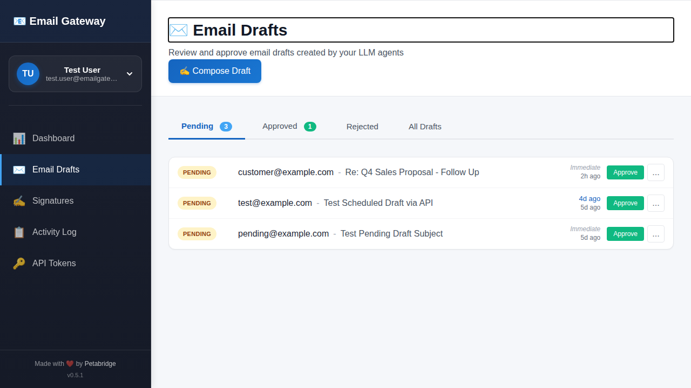
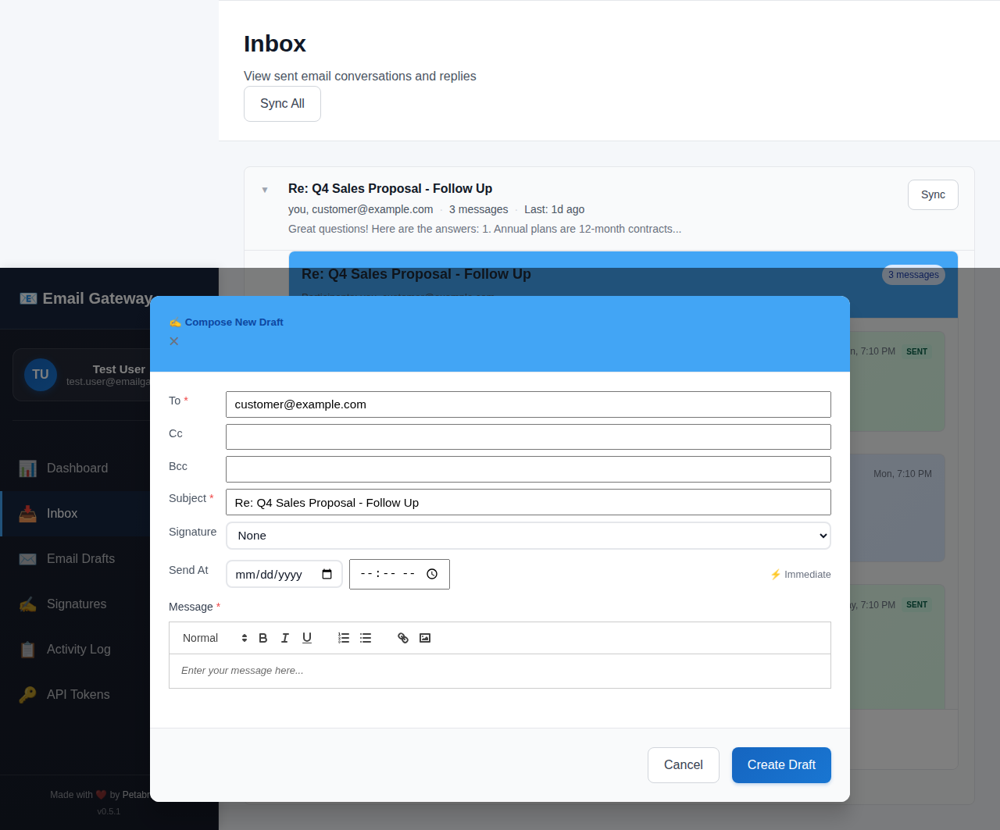

# OpenClaw TextForge Skill


Official OpenClaw skill for [TextForge](https://textforge.net) — safely automate your Gmail with AI.

---

## Use OpenClaw with Confidence

OpenClaw gives your agent incredible power — including the ability to read and send emails. But with that power comes risk: a prompt injection, a hallucination, or a misunderstood instruction could send an email you never intended.

**TextForge makes OpenClaw safer to use** by adding a human approval layer to every email. Your agent gets full email capability — reading threads, drafting replies, managing attachments, tracking draft activity — but **nothing sends without your review**.

### How It Works

1. **Agent drafts** — Your OpenClaw agent reads the thread and composes a response via MCP
2. **You review** — Get notified via Slack, Discord, or webhook with the full draft preview
3. **You decide** — Edit, approve, or reject. When you approve, it sends from your Gmail with your signature
4. **Loop continues** — When they reply, your agent gets notified to draft the next response

Your agent stays productive. You stay in control.


*Review and approve email drafts created by your LLM agents*

### Safety by Design

- **Human-in-the-loop**: Every email requires your approval before sending — catches hallucinations, prompt injection, or just off-tone drafts
- **Scoped API tokens**: Your agent connects through TextForge's API, never touches your Gmail credentials directly. Compromised token? Revoke it without changing your Google password.
- **Full audit trail**: Every draft, edit, approval, and rejection is logged — know exactly what your agent tried to send
- **Pass-through architecture**: Email content is fetched from Gmail on-demand and never stored on TextForge servers

### Works with Other Tools Too

TextForge isn't just for OpenClaw. Claude Code, Claude Desktop, and OpenCode connect via OAuth — one command, no tokens. Cursor, Windsurf, VS Code, Cline, Zed, and Copilot CLI connect via API key. See the [full compatibility table](https://textforge.net/docs/mcp#authentication).

---

## Installation

### 1. Install mcporter
```bash
npm install -g mcporter
```

### 2. Get Your API Token
1. Sign up at [textforge.net](https://textforge.net/login)
2. Generate token at [textforge.net/tokens](https://textforge.net/tokens)
3. Set environment variable:
   ```bash
   export TEXTFORGE_TOKEN="your-token-here"
   ```

### 3. Configure TextForge MCP Server
```bash
mcporter config add textforge https://textforge.net/mcp \
  --header "Authorization: Bearer $TEXTFORGE_TOKEN"
```

### 4. Test the Connection
```bash
mcporter call textforge.list_threads limit:5
```

---

## What Can Your Agent Do?

Once configured, your OpenClaw agent can:

- **Draft emails** — with full thread context, ready for your approval
- **Schedule emails** — set drafts to send at a specific time (after your approval)
- **Search your inbox** — find relevant conversations instantly
- **Read threads** — understand the full conversation history
- **Listen for replies** — webhooks notify your agent when recipients respond
- **Manage follow-ups** — never drop the ball on important conversations
- **Sync inbox state** — keep everything current
- **Manage attachments** — upload files to drafts, download attachments from received messages
- **Import threads** — pull in specific threads by provider ID for context
- **Audit draft activity** — see the full history of every draft (created, edited, approved, rejected)

Your agent gets the power. You keep the control.


*Review thread context and edit drafts before approving*

---

## Available Tools (22)

### Draft Management

| Tool | What It Does |
|------|-------------|
| `create_draft` | Create an email draft and submit for approval |
| `list_drafts` | List drafts with optional status/recipient filtering |
| `get_draft` | Get draft details including status and approval history |
| `update_draft` | Update an existing draft's content or recipients |
| `submit_draft` | Submit a draft for approval (auto-submitted on create) |
| `get_draft_activity` | View complete draft activity log |
| `reject_draft` | Reject a pending draft |
| `delete_draft` | Delete a draft (only non-pending statuses) |

### Thread Management

| Tool | What It Does |
|------|-------------|
| `list_threads` | List recent email threads |
| `list_engaged_threads` | List threads where you've sent messages |
| `get_thread` | Read full thread with messages |
| `get_thread_by_external_id` | Look up thread by provider's thread ID |
| `sync_thread` | Sync a specific thread for latest messages |
| `sync_inbox` | Trigger full inbox sync |
| `search_messages` | Search with Gmail-style query syntax |
| `search_threads_by_contact` | Find threads by contact email |
| `import_thread` | Import a thread from email provider |

### Attachment Management

| Tool | What It Does |
|------|-------------|
| `list_message_attachments` | List attachments on a received message |
| `get_attachment_download_url` | Get presigned download URL for an attachment |
| `list_draft_attachments` | List attachments on a draft |
| `get_draft_attachment_upload_url` | Get presigned upload URL to attach a file |
| `remove_draft_attachment` | Remove an attachment from a draft |

---

## Bundled Skills

This skill pack includes two skills beyond the core TextForge connector:

### Email Writing Guide

Best practices for composing effective, human-sounding emails. Includes:
- 6 core writing principles (be direct, use specific language, frame questions clearly)
- Technical formatting rules (HTML line breaks, no em dashes, no signatures)
- A mandatory AI pattern audit — 12 common LLM writing tells to catch before sending
- Follow-up timing framework
- Anti-pattern reference table
- Pre-send checklist

### TextForge (Core)

Full 22-tool reference with parameter documentation, attachment workflow, draft lifecycle management, and safety features.

---

## Real Use Cases

**Sales follow-ups** — CRM exports leads, AI drafts follow-ups, you approve the batch

**Customer support** — AI reads the thread, drafts a reply with full context

**Procurement** — W-9s, insurance certs, vendor contracts. Downloaded from attachments and forwarded.

**Market research** — Personal outreach from your Gmail, not a bulk tool

**Relationship management** — Never forget a check-in, birthday, or quarterly touch

**Document workflows** — Download received attachments, process them, and attach results to reply drafts

[See all use cases →](https://textforge.net/use-cases)

---

## Pricing

Try it free for 7 days. No credit card required.

| Plan | Price | What's Included |
|------|-------|-----------------|
| **Solo** | $9.99/month | 20 drafts/day, 2 webhooks, 30-day inbox sync |
| **Pro** | $19.99/month | Unlimited drafts, 10 webhooks, full inbox history |

---

## Learn More

- **[TextForge](https://textforge.net)** — Home
- **[OpenClaw Use Case](https://textforge.net/use-cases/openclaw)** — Why this matters for OpenClaw users
- **[MCP Documentation](https://textforge.net/docs/mcp)** — Full API reference
- **[Agent Safety](https://textforge.net/use-cases/agentic-workflows)** — General agent safety principles

---

## Documentation

- [SKILL.md](./SKILL.md) — Complete 22-tool reference, formatting guidelines, and workflows
- [skills/email-writing/SKILL.md](./skills/email-writing/SKILL.md) — Email writing best practices and AI pattern audit

---

*Set up in 5 minutes. Use OpenClaw with confidence.*
